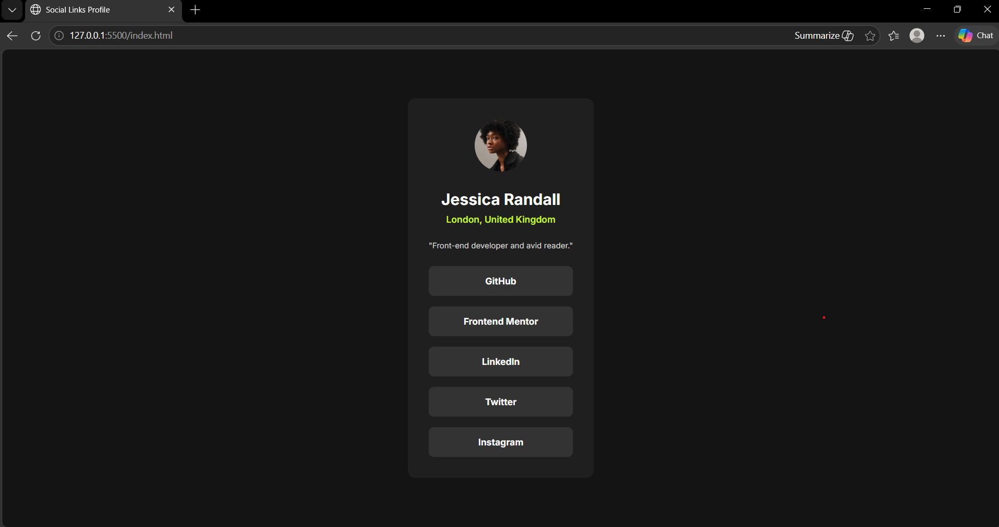

# Frontend Mentor - Social Links Profile Solution

This is my solution to the Social Links Profile challenge on Frontend Mentor. The project focuses on building a responsive profile card using semantic HTML and modern CSS techniques.

---

## Overview

### The Challenge

Users should be able to:

- View the optimal layout depending on their device screen size
- See hover and focus states for all interactive elements

---

## Screenshot



---

## Links

- Live Site URL: https://sasi-2006.github.io/Social_link_profile/
- Repository URL: https://github.com/Sasi-2006/social-links-profile

---

## Built With

- Semantic HTML5 markup
- CSS custom properties
- Flexbox
- Mobile-first workflow
- Responsive design
- Accessibility best practices

---

## What I Learned

While building this project, I improved my understanding of:

- Semantic HTML structure
- Flexbox alignment and centering
- Responsive design using media queries
- CSS hover, focus, and active states
- Accessibility improvements for keyboard users
- Using CSS variables for reusable colors

Example of Flexbox centering:

```css
body{
    display:flex;
    justify-content:center;
    align-items:center;
    min-height:100vh;
}
```

Example of button hover effect:

```css
.social-links a:hover{
    background-color:var(--green);
    color:black;
    transform:translateY(-2px);
}
```

---

## Continued Development

In future projects, I would like to focus more on:

- Advanced responsive layouts
- CSS animations
- Accessibility improvements
- Better component structuring
- Learning JavaScript interactions

---

## Useful Resources

- Frontend Mentor
- MDN Web Docs
- CSS Tricks Flexbox Guide

---

## Author

- GitHub - https://github.com/Sasi-2006

---

## Acknowledgments

Thanks to Frontend Mentor for providing real-world frontend challenges that help improve practical development skills.
